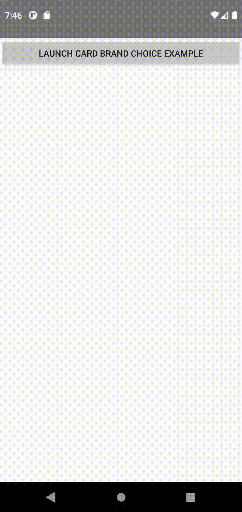

# Android (Kotlin)

## Running the project
To run this app, you'll need to first run the sample server locally. Follow the "How to run locally"
instructions in the root directory's README.md to get started.

After running the sample server:

1. Open this folder in Android Studio IDE.
2. Build and run the app using the Android emulator.

## Demo
Find below a demo of the happy path scenario of selecting a `Cartes Bancaires` network instead of the default `Visa` one.

