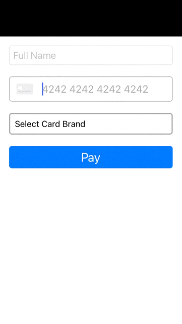

# Card Brand Choice

Stripe accepts co-branded card like Visa/CB, which means payment can be processed on either network.
This integration shows you how to select card network when creating a payment.

## How to run locally
**Run IOS(Swift) client locally:**

- Run `pod install` to install the Stripe iOS SDK.
- Open `app.xcworkspace`.
- Build and run the appropriate project (Swift) in the iOS simulator.

## Demo
When setup has completed successfully, running the app in the emulator should look like this:  

