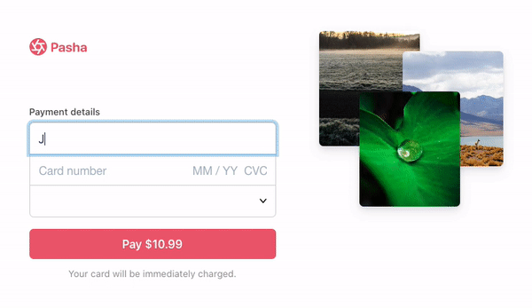

# HTML Client

## Run Locally

To run this app, you'll need to first run the sample server locally. Follow the "How to run server locally"
instructions in the root directory's README.md to get started.

After running the sample server, visit localhost:4242 in your browser.

## Demo

* [Try it out](https://tkzim.sse.codesandbox.io/)
* [Fork on CodeSandbox](https://codesandbox.io/s/github/stripe-samples/card-brand-choice/tree/codesandbox/)

This is what html+js client looks like:  
